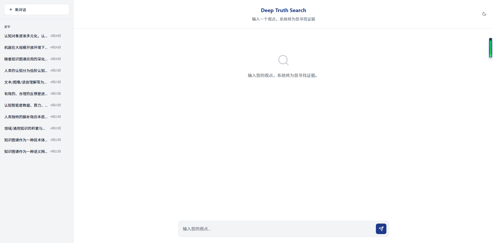
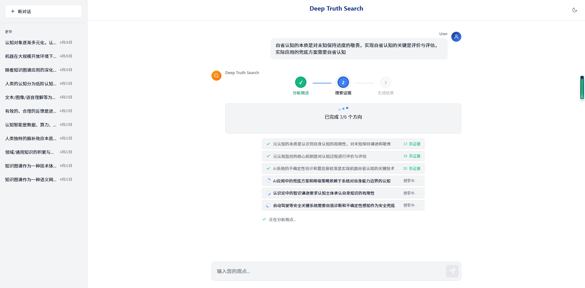
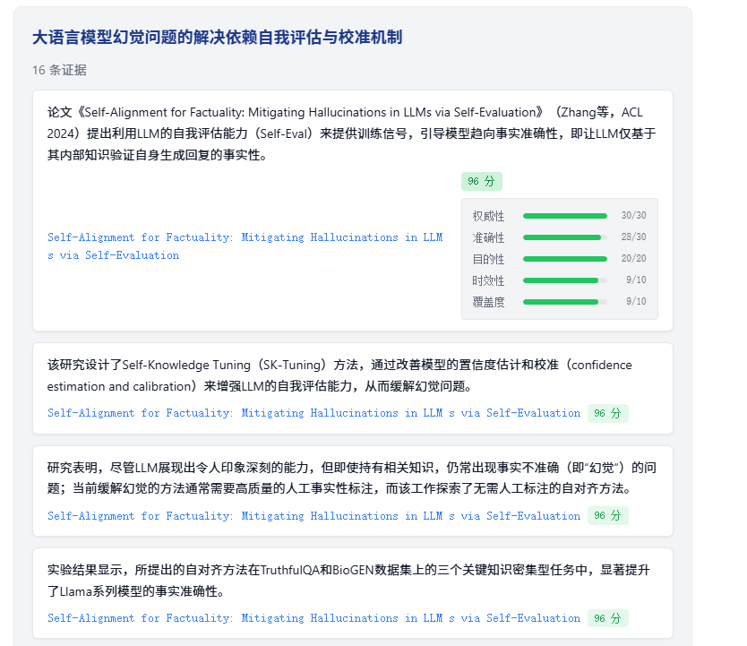
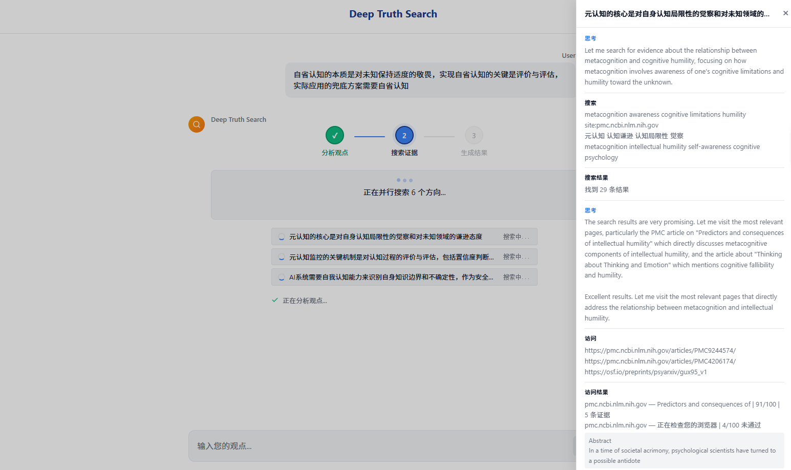
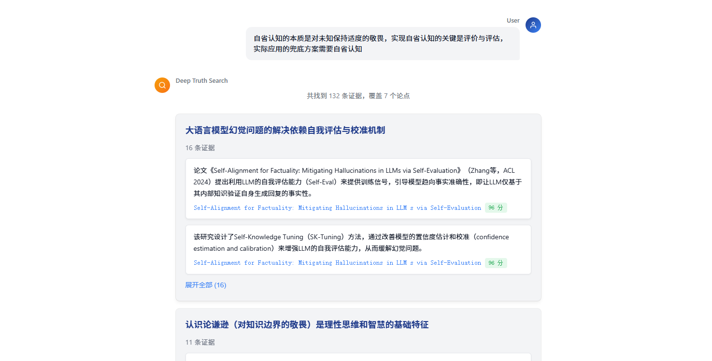
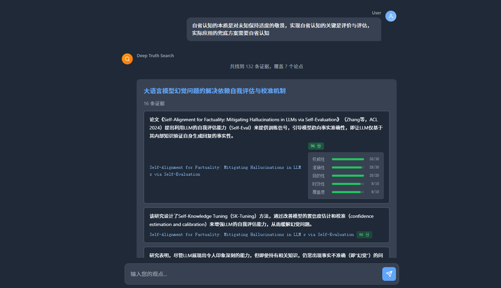

# Deep Truth Search

一个为你的观点寻找支撑证据的研究型 Agent——用得越多，它越知道去哪找。

> [English Version](README.md)



## 它做什么

你有一个观点，你需要证据。

输入一个观点，系统会：
1. 自动拆解成多个搜索方向（技术、应用、学术、政策等角度）
2. 并行深度搜索，实际访问页面阅读内容
3. 对每个来源做五维质量评分，过滤低质量页面
4. 返回结构化的「论点 + 论据」，每条附带来源链接和评分明细

你只需要做最后一步：从大量高质量证据中，自己判断。

---

## 设计哲学

> **不替用户做判断，只负责提供大量高质量证据。**

这不是一个"给你答案"的工具。它是一个证据搜集工具——搜得深、搜得广、质量可评估、来源可追溯。最终的判断权始终在你手里。

**这个工具为你的观点服务，不跟你唱反调。**

当你说"X 是这个城市有史以来最好的市长"，系统：
- 不会把这句话软化成"X 是一位优秀的市长"
- 不会因为网上批评 X 的声音更大就给你反面材料
- 不会出于"客观性"考虑擅自修改你的观点

你输入什么观点，系统就忠实地为这个观点找支撑证据。措辞不改、方向不偏、立场不变。

---

## 核心特色

### 1. 专为「观点找证据」设计

这不是通用搜索，也不是 AI 聊天。系统围绕一个核心场景优化：你有一个观点，需要找到支撑它的证据。

系统会自动将观点拆解为多个子方向，并行搜索后汇总。比单一关键词搜索覆盖面广得多。



### 2. 五维证据质量评分

每条证据不是"搜到就用"。系统用 LLM 模拟专业评审人员，从五个维度独立评分：

| 维度 | 满分 | 评什么 |
|------|------|--------|
| **权威性** | 30 | 作者资质、机构背书、专业背景 |
| **准确性** | 30 | 引用来源、数据支撑、可验证性 |
| **目的性** | 20 | 教育/研究 vs 营销/广告 |
| **时效性** | 10 | 发布时间、内容新鲜度 |
| **覆盖度** | 10 | 分析深度、论述完整性 |

只有总分超过质量阈值（默认 60/100）的页面才能贡献证据。评分逻辑不依赖域名白名单，而是让 LLM 从内容本身判断——一个个人博客如果论证严谨，照样能得高分。



### 3. 自进化信息源系统

这是本项目最大的差异点。系统不只是搜索，它会学习「哪些地方值得搜」。

每次搜索后，系统会：
- 记录每个来源的表现（评分、通过率）
- 自动给来源分层：**Elite → Trusted → Verified → Trial → Deprecated**
- 下次遇到类似主题时，优先搜索历史高分来源

这意味着：
- 第 1 次使用：正常搜索，结果已经很好
- 第 5 次使用：系统开始利用历史来源，搜索更快
- 第 20 次使用：高价值来源积累充分，结果明显更准

用户无需任何操作。自进化完全在后台自动发生。

### 4. 搜索过程完全透明

不是黑盒。你可以实时看到：
- Agent 的思考过程（为什么选择这个搜索策略）
- 具体的搜索查询
- 访问了哪些页面
- 每个页面的评分和理由



### 5. 两段式评估架构

搜索和评估分两步进行，节省资源又保证质量：

- **轻评估**：搜索结果返回后，Agent 自主判断哪些链接值得深入访问
- **重评估**：访问页面后，LLM 按五维标准正式评分，决定是否纳入证据池

这比"搜到就用"或"全部重评"都更高效。

### 6. 结构化输出

结果不是一大段文字总结，而是按「论点 + 论据」组织：



每条论据包含：
- 证据摘要（中文）
- 原始来源链接（可直接点击回溯）
- 五维评分（可展开查看详情）
- 来源域名

---

## 快速开始

### 环境要求

- Python 3.10+
- LLM API Key
- Serper API Key

### 克隆项目

```bash
git clone https://github.com/HYC-hsy/deep-truth-search.git
cd deep-truth-search
```

### 创建虚拟环境

```bash
# conda
conda create -n deep-truth-search python=3.10
conda activate deep-truth-search

# 或 venv
python -m venv venv
source venv/bin/activate  # Windows: venv\Scripts\activate
```

### 安装依赖

```bash
pip install -r requirements.txt
```

### 配置 API Key

```bash
cp .env.example .env
```

编辑 `.env` 文件。系统使用两个 LLM，职责不同：

| 用途 | 角色 | 推荐模型 | 说明 |
|------|------|----------|------|
| **主 LLM** | Agent 思考、观点拆解、搜索策略、证据提取 | claude-opus-4-6 | 需要较强的推理和规划能力，建议用你能负担的最强模型 |
| **评分 LLM**（可选） | 五维质量评分 | gpt-4o | 任务相对简单，用便宜一些的模型即可 |

> 如果不配置评分 LLM，系统会用主 LLM 同时承担两个角色——可以用，但成本更高。

**主 LLM**（必填，支持任何 OpenAI 兼容 API）：

```env
LLM_PROVIDER=anthropic
LLM_API_KEY=sk-your-api-key-here
LLM_BASE_URL=https://api.anthropic.com/v1
LLM_MODEL=claude-opus-4-6
```

**评分 LLM**（可选，推荐配置以节省成本）：

```env
SCORING_LLM_API_KEY=sk-your-scoring-api-key
SCORING_LLM_BASE_URL=https://api.openai.com/v1
SCORING_LLM_MODEL=gpt-4o
```

**搜索 API**（必填）：

[Serper](https://serper.dev/) — 注册即可获得免费额度（2500 次搜索），足够深度体验。

```env
SEARCH_PROVIDER=serper
SEARCH_API_KEY=your-serper-api-key-here
```

> 完整配置项和说明见 [.env.example](.env.example)。

### 运行

```bash
python main.py
```

浏览器会自动打开 `http://127.0.0.1:8888`。输入你的观点，等待系统返回证据。

> 首次搜索通常需要 3-10 分钟（取决于观点复杂度和网络状况）。搜索过程中你可以实时看到进度。

---

## 系统架构

```
用户输入观点
    |
    v
Main Agent（全局研究控制器）
    |-- 拆解子观点（多角度覆盖）
    |-- 读取历史优质来源（披露窗口）
    |-- 并行调度 Search Agent
    |-- 评估覆盖度，决定是否补搜
    |-- 选出记忆候选来源 -> 写入长期记忆
    |-- 组装结构化结果
    |
    v
Search Agent x N（并行执行）
    |-- 生成搜索查询（多语言、多角度）
    |-- 调用搜索 API 获取候选
    |-- Agent 自主判断哪些值得访问
    |-- 访问页面，提取结构化内容
    |-- 五维质量评分
    |-- 提取证据片段
    |-- 判断是否需要补搜
    |
    v
结构化输出（论点 + 论据 + 评分 + 链接）
```

### 核心模块

| 模块 | 路径 | 职责 |
|------|------|------|
| Main Agent | `agents/main_agent.py` | 全局研究控制循环 |
| Search Agent | `agents/search_agent.py` | 单子观点深度搜索执行器 |
| Agent Loop | `agents/agent_loop.py` | 通用 think-act-observe 循环引擎 |
| 搜索工具 | `tools/search_tool.py` | 外部搜索 API 封装（Provider 模式，可扩展） |
| 页面访问 | `tools/visit_tool.py` | 网页 / PDF 内容提取 |
| 五维评分 | `scoring/scoring.py` | LLM 驱动的质量评估（无域名白名单） |
| 信息源记忆 | `memory/source_memory.py` | 五层分级 + 升降级 + 披露窗口 |
| Web UI | `ui/` | ChatGPT 风格前端（零框架依赖） |

---

## 技术栈

- **后端**: Python, FastAPI, SSE（实时推送搜索进度）
- **前端**: 原生 HTML/CSS/JS（零框架依赖，~30KB）
- **LLM**: 任何 OpenAI 兼容 API（Claude / GPT / DeepSeek 等）
- **搜索**: Serper（Google Search API，Provider 模式可扩展）
- **页面提取**: trafilatura（HTML）, pymupdf4llm（PDF）
- **数据模型**: Pydantic
- **存储**: JSON 文件（Repository 模式，可扩展至 SQLite）

---

## 配置说明

所有配置通过 `.env` 文件管理。主要配置项：

| 配置 | 默认值 | 说明 |
|------|--------|------|
| `LLM_MODEL` | `claude-opus-4-6` | 主 LLM 模型 |
| `QUALITY_THRESHOLD` | `60` | 证据质量准入阈值（0-100） |
| `MEMORY_THRESHOLD` | `75` | 来源记忆准入阈值 |
| `MAX_PARALLEL_SEARCHES` | `3` | 并行搜索数 |
| `MAIN_AGENT_MAX_TURNS` | `12` | Main Agent 最大轮次 |
| `SEARCH_AGENT_MAX_TURNS` | `8` | Search Agent 最大轮次 |
| `DISCLOSURE_WINDOW_SIZE` | `15` | 披露窗口大小（向 Agent 展示的历史优质来源数） |

完整配置和注释见 [.env.example](.env.example)。

---

## Dark Mode

支持亮色 / 暗色主题，跟随系统偏好或右上角手动切换。



---

## 适合谁用

- **想验证一个观点的人** — 输入观点，获得多角度证据
- **写论文/报告的学生** — 快速收集高质量参考来源
- **教师和研究者** — 做主题调研，收集多来源证据
- **内容创作者** — 为文章、视频找可靠支撑材料
- **任何需要"找证据"的人** — 不需要专业检索能力

---

## 贡献

欢迎贡献！

- 提交 Bug 报告或功能建议 → [Issues](https://github.com/HYC-hsy/deep-truth-search/issues)
- 提交 Pull Request
- 添加新的搜索引擎适配器（实现 `SearchProvider` 接口）
- 改进评分逻辑
- 改进 UI/UX

---

## License

[MIT](LICENSE)
